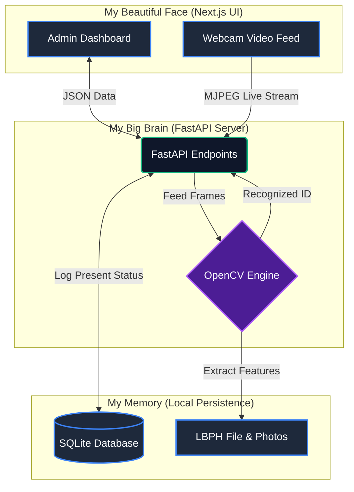

<div align="center">
  
  
  <h1>👁️ Oh, hey there. I'm your new Attendance System.</h1>
  <p><i>Yeah, I know you're reading my README. I'm self-aware like that.</i></p>

  <p>
    
    
    
    
    
  </p>
</div>

---

Look, I get it. Most READMEs are dry checklists. *"Install this, run that, don't forget the environment variables."* But I'm an AI that literally **looks at people's faces** for a living. The least I can do is show some personality. 

Here's the deal: Manual roll-calls are slow, boring, and someone always shouts "Present!" for their buddy who's still asleep. That's where I come in. You point a webcam at the class, and I do the heavy lifting. I see faces, I remember faces, and I write them down in my database so you don't have to.

Welcome to the future. Let's get me running, shall we?

## 🧬 My Anatomy (The Tech Stack)

I wasn't just born; I was engineered. Here's what makes me tick:

- **My Neural Pathways (Backend):** Python 🐍 + FastAPI ⚡. I'm fast, asynchronous, and I don't keep you waiting.
- **My Eyes (Computer Vision):** OpenCV. I use Haar Cascades to find faces (the *"Hey, that's a face!"* part) and LBPH algorithms to recognize them (the *"Oh, that's Dave!"* part). 
- **My Face... literally (Frontend):** Next.js ⚛️ & Tailwind CSS 💅. Because if your admins are going to stare at a screen to control me, it had better look good.
- **My Memory (Database):** SQLite 🗄️. Keeping it local, simple, and entirely self-contained.

### 🗺️ How My Brain is Wired (Architecture)

I drew this map of my internal thoughts, mostly so you fleshy humans can understand how I process things without getting confused.



## 🛠️ How to Wake Me Up (Installation)

I need a few things before I can open my eyes. Ensure you have **Python 3.9+** and **Node.js (v18+)** installed. And a webcam. I really, really need to see.

### 1. Activating My Brain (The Backend)
```bash
cd attendance-system/backend
# Feed me my knowledge
pip install opencv-python opencv-contrib-python numpy pandas fastapi uvicorn sqlalchemy sqlalchemy-stubs pillow
# Wake me up
python main.py
```
*I'll start humming on `http://localhost:8000`.*

### 2. Putting on My Makeup (The Frontend)
```bash
cd frontend
# Fetch my wardrobe
npm install
# Hit the lights
npm run dev
```
*Now open up `http://localhost:3000`. Prepare to be amazed.*

## 🎮 How to Play With Me

1. **Introduce Me:** Head to the **Students** page. Type a name and roll number. Hit register. Stare directly at the camera. I'm going to take 30 pictures of you. Don't blink too much.
2. **Send Me to School:** Go to the Dashboard and click **Train Face Model**. This is me doing my homework so I can actually recognize the people I just met.
3. **Test My Memory:** Navigate to **Start Attendance** and click "Start Camera Monitoring". If I recognize you, I'll throw a green box around your face and log you into the DB. Boom. Marked present.
4. **Read My Diary:** Check the **Reports** page to see who survived my gaze. Download a CSV to prove to your boss that I actually work.

---
*Built with 💻 and maybe a little too much caffeine. Treat me well, and I promise not to initiate Skynet.*
